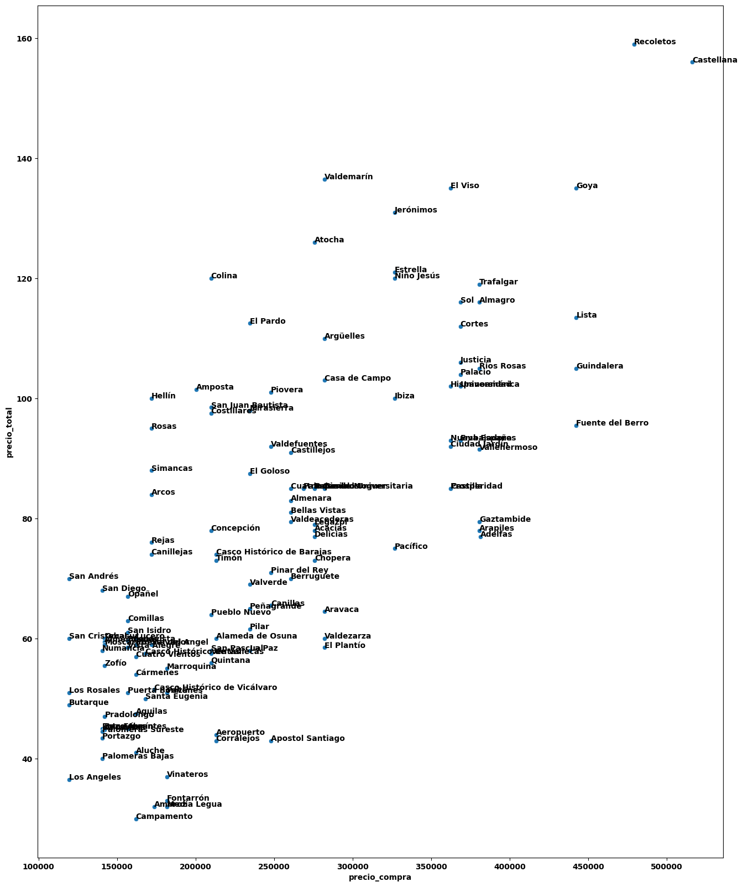
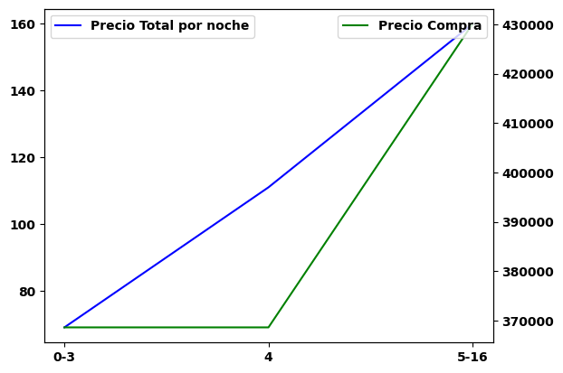
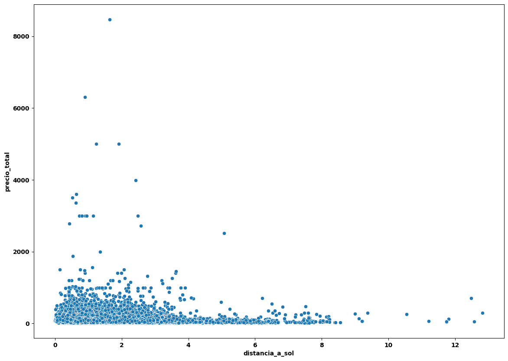
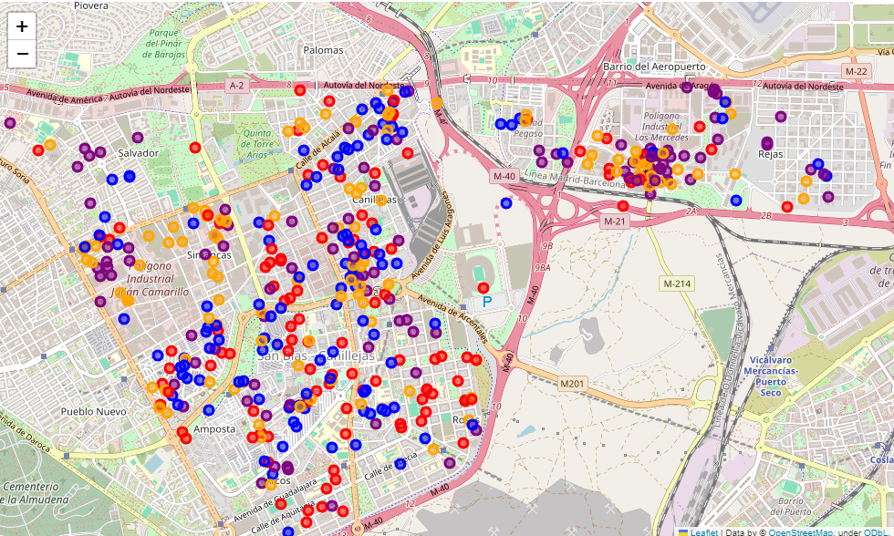

# Informe Ejecutivo: Análisis de Inversión Inmobiliaria en Madrid

Este informe ejecutivo resume los hallazgos clave de un análisis de Discovery realizado con los datos sobre alquileres disponibles en la web de Airbnb [Inside Airbnb](https://insideairbnb.com/get-the-data/). El objetivo principal del análisis es proporcionar información estratégica para dirigir la búsqueda de oportunidades de inversión inmobiliaria en la ciudad de Madrid, con un enfoque en el alquiler turístico.

## Contexto del Análisis

Se ha seleccionado Madrid como la ciudad objetivo para invertir en inmuebles con el fin de obtener rentabilidad a través del alquiler turístico. Antes de iniciar la búsqueda de propiedades, se ha realizado un análisis de Discovery para identificar estrategias que guíen el trabajo del equipo de valoraciones. Al no disponer en la base de datos de los precios de las viviendas, se han estimado utilizando la siguiente lógica:

- Una habitación: m2 = 60
- Dos habitaciones: m2 = 70
- Tres habitaciones: m2 = 90
- Cuatro habitaciones: m2 = 120
- Cinco o más habitaciones: m2 = 150

Posteriormente se ha multiplicado el precio por metro cuadrado de cada distrito con datos de Idealista por los metros cuadrados estimados de la vivienda. La tecnología utilizada para el análisis ha sido Python.

## Objetivos

- Analizar fuentes de datos públicas para comprender el mercado inmobiliario en Madrid.
- Identificar insights que orienten la búsqueda de oportunidades de inversión.
- Enfocarse en aspectos clave como el precio del alquiler por noche, niveles de ocupación y precio de compra de los inmuebles.

## Conclusiones Ejecutivas

- Se han identificado algunos barrios con alto potencial de inversión.
- Se recomienda buscar inmuebles con capacidad para alojar 3 huéspedes.
- No es necesario que las propiedades estén cerca de puntos de interés en los barrios identificados.
- Se sugiere considerar el desarrollo de un nuevo producto de alquiler para eventos deportivos en el barrio de San Blas.

## Detalle de los Principales Resultados

### 1. Existen 12 barrios con buen potencial de inversión

Se han identificado algunos barrios que ofrecen una relación coste-ingresos favorable para la inversión. Estos barrios se pueden clasificar en 4 grupos según la calidad del inmueble:

**Bajo:** San Andrés, San Diego, Opañel  
**Medio-Bajo:** Hellín, Rosas, Simancas, posiblemente los 3 sean de San Blas  
**Medio:** Valdemarín, Atocha  
**Medio-alto:** Jerónimos, El Viso  
**Alto:** Recoletos, Castellana  

### 2. Buscar inmuebles de una habitación que permitan 3 huéspedes

El número óptimo de huéspedes está en 3 personas. No hay mucha diferencia con viviendas de 0 a 3 personas. A partir de 5 el piso necesita ser mayor y el precio de compra se incrementa bastante.

### 3. Buscar inmuebles que no estén necesariamente cerca de puntos de interés

La cercanía a puntos de interés no parece tener un impacto significativo en el precio del alquiler, por ejemplo la cercanía con la Puerta del Sol.

### Evaluación del Desarrollo de un Nuevo Producto basado en el Alquiler para Momentos concretos de Alto Interés Deportivo

Buscar oportunidades en el barrio de San Blas. Todavía existen muchos alquileres que no están explotando este potencial.

**Leyenda de Precios (de menor a mayor):**  
Morado - Azul - Naranja - Rojo

En el gráfico se representa el precio promedio de alquiler en el bariro de San-Blás, donde los colores indican los rangos de precios desde menor a mayor. 
La presencia de muchos puntos en colores morados y azules sugiere que aún hay potencial para explotar más el factor de los eventos deportivos cerca del estadio Wanda Metropolitano. 

#### Disclaimer:

Este proyecto no pretende ofrecer recomendaciones de inversión. Los resultados y conclusiones aquí presentados son producto de un análisis de datos y deben ser interpretados con precaución.

